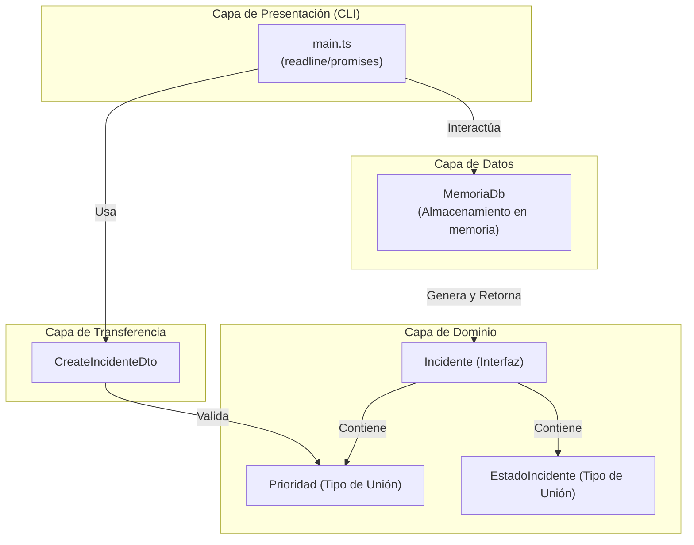
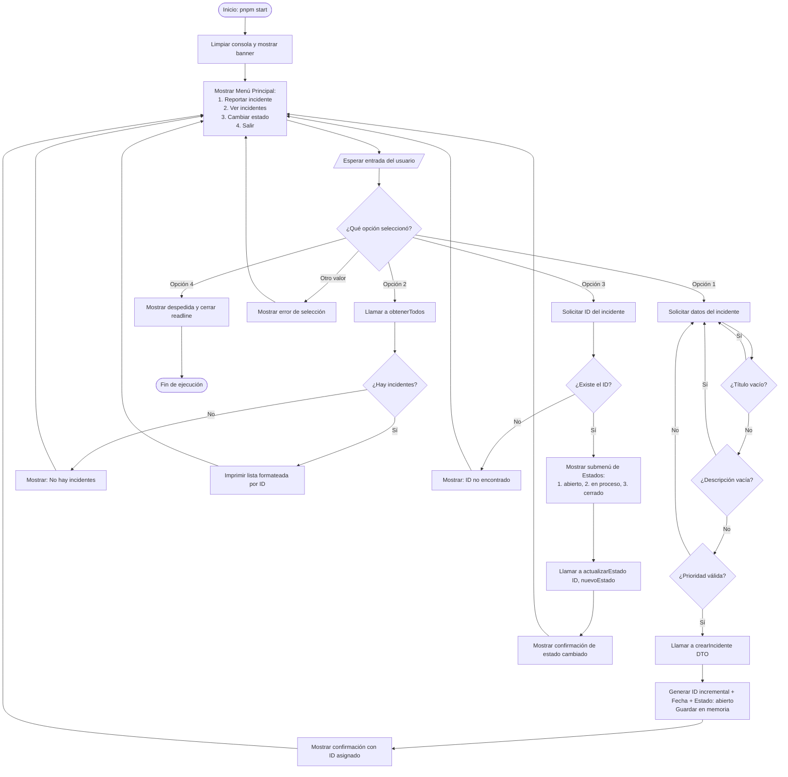

# Diagrama de Funcionamiento: Sistema de Incidentes C-27

Este documento presenta la arquitectura modular y el flujo de ejecución interactivo del sistema de reportes de soporte para el laboratorio C-27.

---

## 1. Arquitectura de Módulos (Clean Architecture)

El proyecto sigue una estructura desacoplada donde la interfaz de usuario (CLI) no accede a estructuras de datos rígidas directas, sino que se comunica mediante **DTOs** e **Interfaces** con la base de datos en memoria (`MemoriaDb`).

---

## 2. Diagrama de Flujo de Operaciones (CLI Loop)

El siguiente diagrama detalla cómo se comporta la aplicación durante la ejecución del bucle interactivo de consola:

